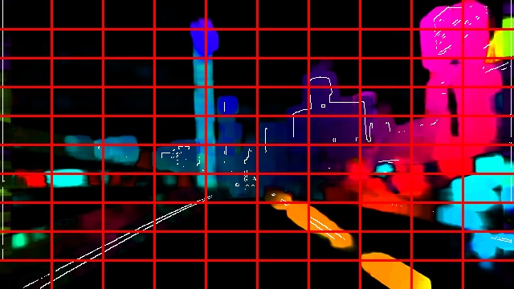
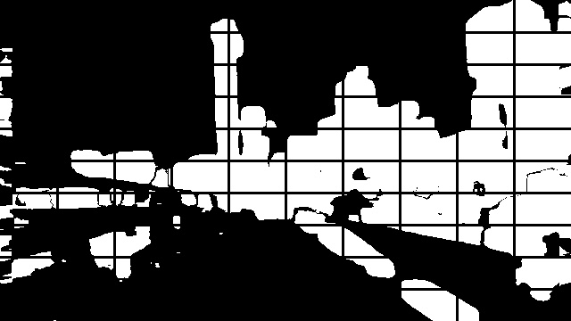

### Pre accident Situation Analysis Based on Locally of Motion

We developed a new feature using optical flow and grid division of space.
 It's captured robustness locally of motion and we used it for a dangerous detector for industrial machine. If you want to know detail of this, please refer original paper.

Original paper: 　https://ieeexplore.ieee.org/document/8517229

I prepared develop emvironment using docker and I packaged my programs as a ROS package.

Eight_direction.py

Two_direction.py

